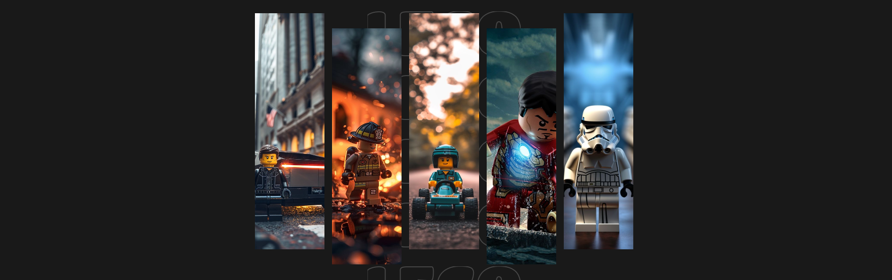
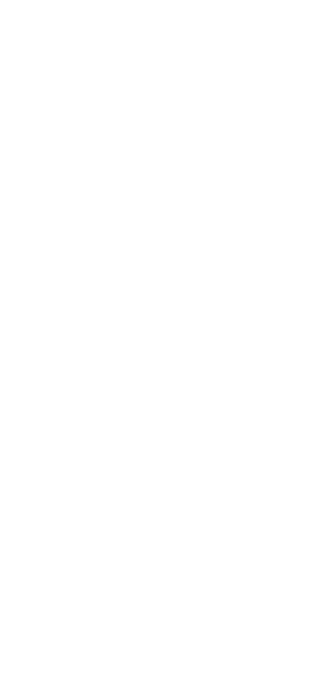
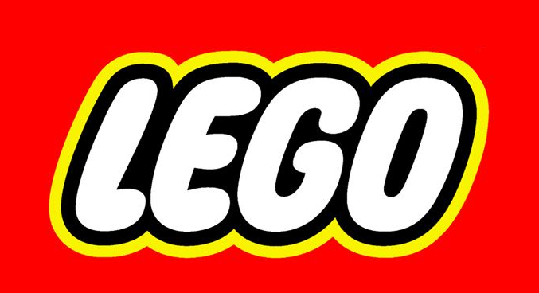
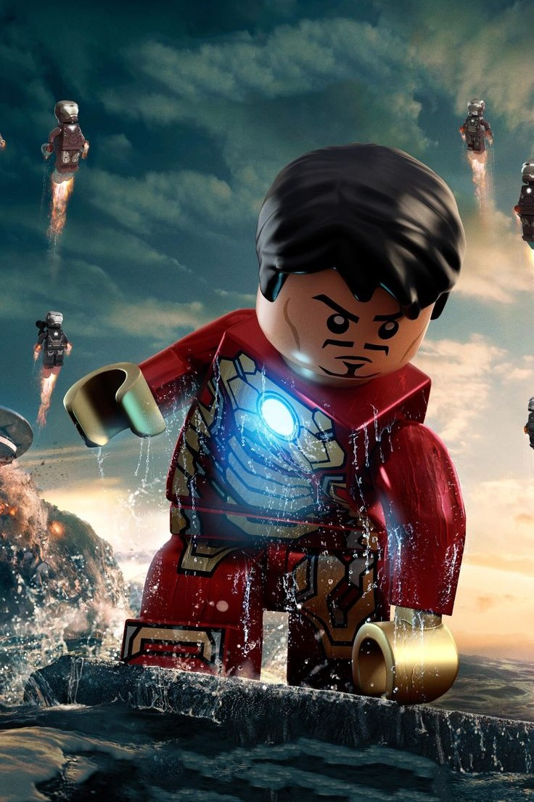

# Gallery LEGO ⭐⭐⭐⭐⭐


<p align="center" style="color: white;">
    
</p>

<p>
    <a href="https://www.linkedin.com/in/juan-estaban-ar%C3%A9valo-056bab240/" target="_blank" rel="Linkedin">
      
    </a> 
    <a href="https://www.instagram.com/jeacsi.official_022?igsh=MWJ6MHRwcnhoZXVxbQ==" target="_blank" rel="Instagram">
      
    </a>
</p>
<p>Esta galería interactiva está diseñada para exhibir una colección de imágenes con un efecto visual impactante y dinámico. Se organiza en una cuadrícula de cinco columnas, donde cada imagen se enmarca con un logotipo rotado y semitransparente. La galería ofrece un efecto de enfoque y ampliación cuando el usuario pasa el cursor sobre una de las imágenes, destacándola del resto</p>


> <p>Las imágenes no seleccionadas se desvanecen a un tono en escala de grises con una opacidad reducida, mientras que la imagen seleccionada se resalta con colores vibrantes y mayor claridad.</p>

> <p>El fondo de la página es oscuro, lo que crea un contraste dramático que hace que las imágenes resalten aún más.</p>

> <p>La cuadrícula se adapta automáticamente, expandiendo la columna correspondiente a la imagen resaltada para darle mayor protagonismo.</p>


```bash
    git clone https://github.com/Juanes200122/Gallery.git
    cd Gallery
```
<div align="right">
    


</div>

## <b>Base en HTML de la Gallery🚀</b>


```Html
     <div class="container">
        <div class="box box-1 cont-element">
            
            
        </div>
        <div class="box box-2 cont-element">
            
            
        </div>
        <div class="box box-3 cont-element">
            
            
        </div>
        <div class="box box-4 cont-element">
            
            
        </div>
        <div class="box box-5 cont-element">
            
            
        </div>
    </div>
```
</br>
</br>


## <b> Skills</b>
  
  


